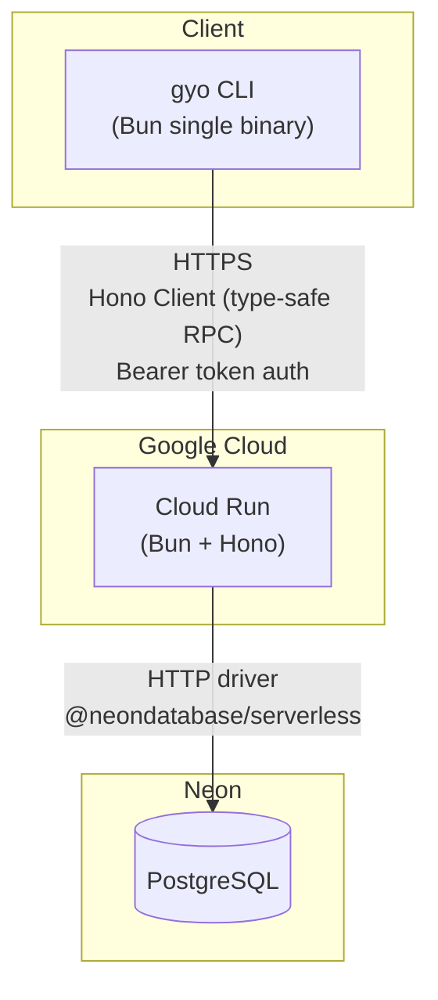

# Architecture (v0.0.1)

## System Diagram

## API

| Method | Path | 説明 |
|---|---|---|
| POST | /api/v1/tasks | タスク作成 |
| GET | /api/v1/tasks | タスク一覧（status / priority / due / q でフィルタ）|
| GET | /api/v1/tasks/:id | タスク詳細 |
| PATCH | /api/v1/tasks/:id | タスク更新 |
| POST | /api/v1/tasks/:id/done | 完了にする |
| DELETE | /api/v1/tasks/:id | キャンセル（ソフトデリート）|
| GET | /api/v1/tasks/:id/relations | リレーション一覧 |
| POST | /api/v1/tasks/:id/relations | リレーション追加 |
| DELETE | /api/v1/tasks/:id/relations/:rid | リレーション削除 |
| GET | /health | ヘルスチェック |

## Auth (v0.0.1)

静的 API トークン認証。`GYO_API_TOKEN` を環境変数に設定し、
リクエストは `Authorization: Bearer <token>` で認証する。

Google OAuth は v0.1.0 以降で追加予定。
