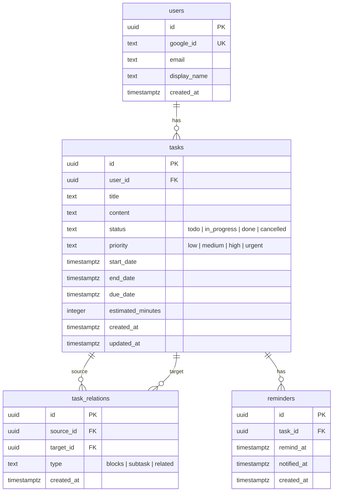

# Data Model (v0.0.1)

```mermaid
erDiagram
  users {
    uuid id PK
    text google_id UK
    text email
    text display_name
    timestamptz created_at
  }

  tasks {
    uuid id PK
    uuid user_id FK
    text title
    text content
    text status "todo | in_progress | done | cancelled"
    text priority "low | medium | high | urgent"
    timestamptz start_date
    timestamptz end_date
    timestamptz due_date
    integer estimated_minutes
    timestamptz created_at
    timestamptz updated_at
  }

  task_relations {
    uuid id PK
    uuid source_id FK
    uuid target_id FK
    text type "blocks | subtask | related"
    timestamptz created_at
  }

  reminders {
    uuid id PK
    uuid task_id FK
    timestamptz remind_at
    timestamptz notified_at
    timestamptz created_at
  }

  users ||--o{ tasks : "has"
  tasks ||--o{ task_relations : "source"
  tasks ||--o{ task_relations : "target"
  tasks ||--o{ reminders : "has"
```
